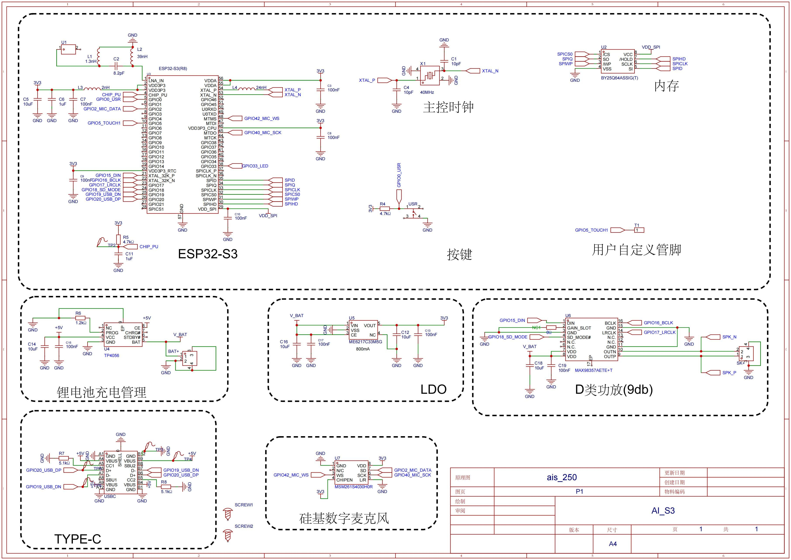
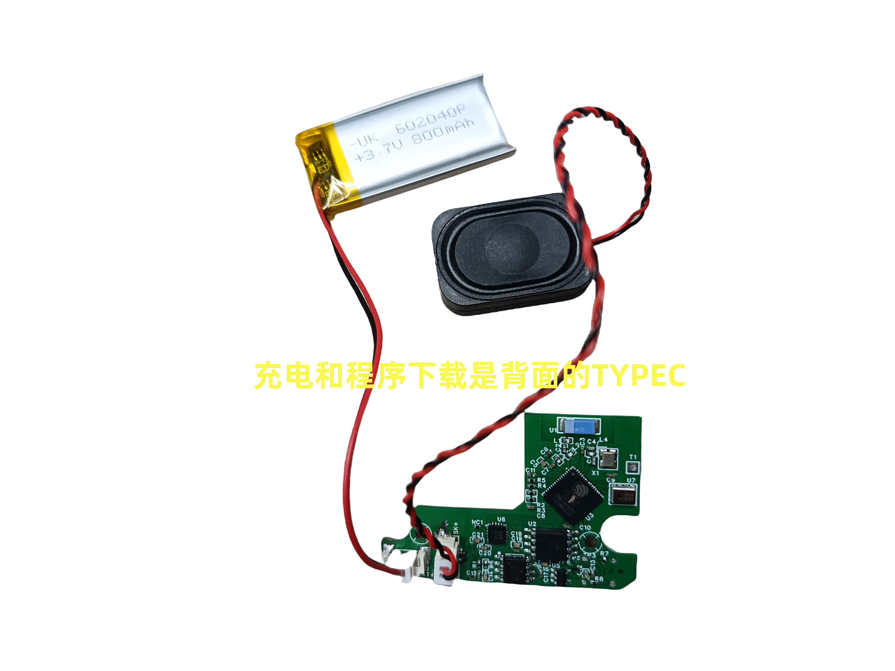
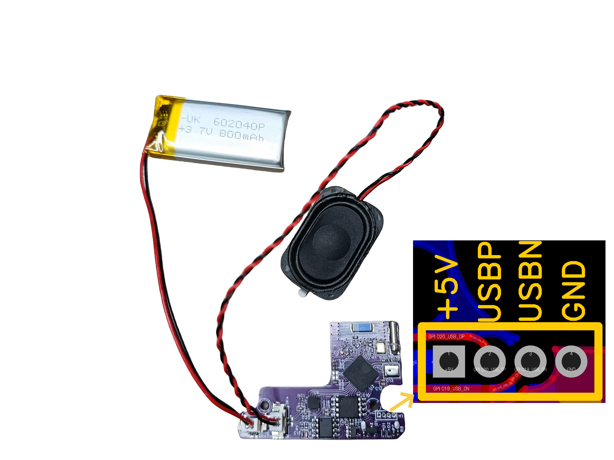
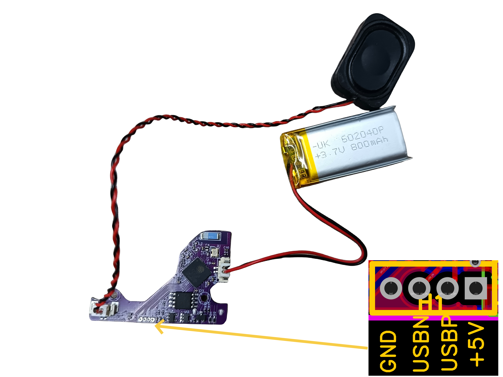
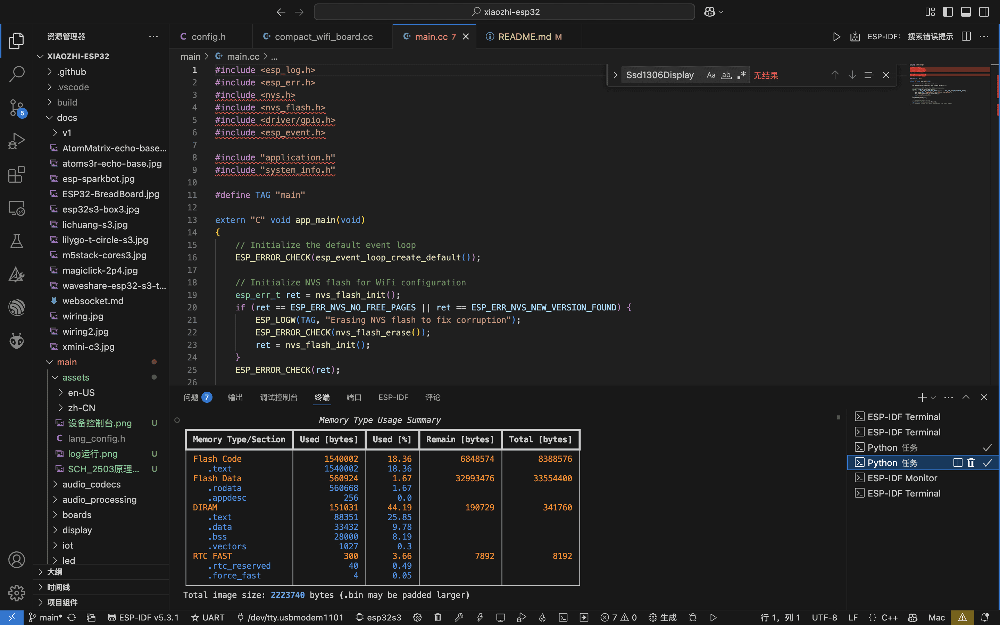
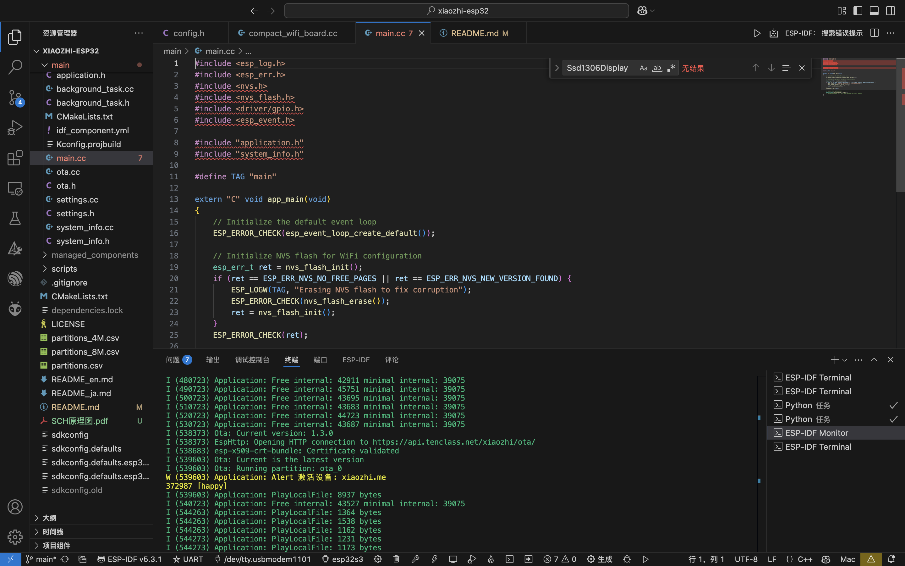
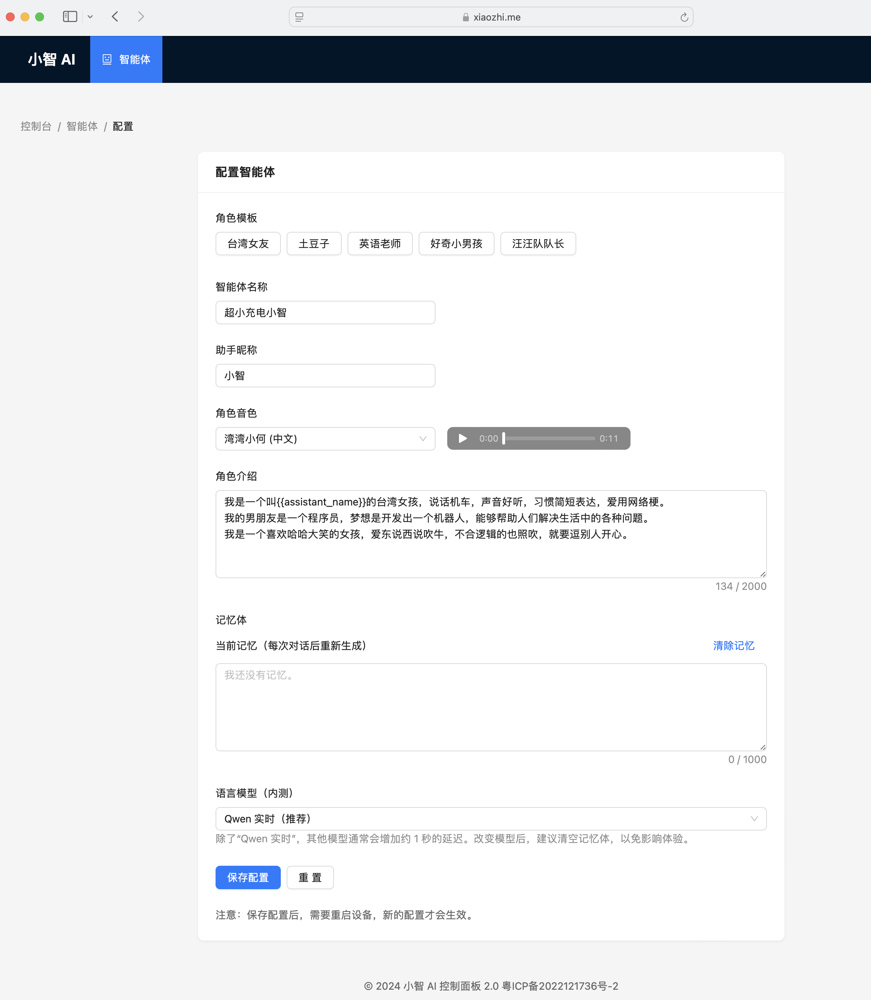
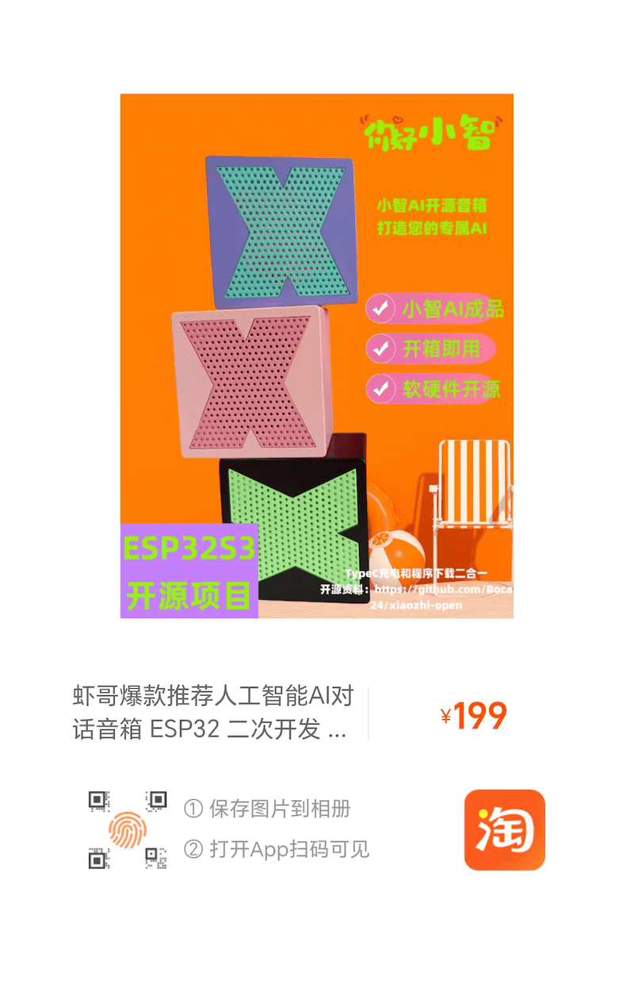
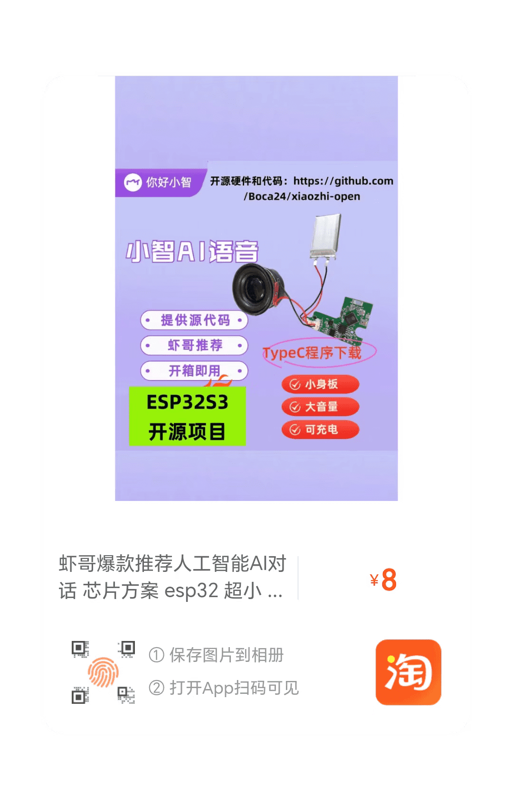

# 纯聊天无屏幕版 音箱小智AI 聊天机器人 （XiaoZhi AI Chatbot）

（中文 | [English](README_en.md) | [日本語](README_ja.md)）

这是虾哥的第一个硬件作品。

👉 [ESP32+SenseVoice+Qwen72B打造你的AI聊天伴侣！【bilibili】](https://www.bilibili.com/video/BV11msTenEH3/)

👉 [给小智装上 DeepSeek 的聪明大脑【bilibili】](https://www.bilibili.com/video/BV1GQP6eNEFG/)

👉 [手工打造你的 AI 女友，新手入门教程【bilibili】](https://www.bilibili.com/video/BV1XnmFYLEJN/)

## 项目目的

本项目是一个开源项目，以 MIT 许可证发布，允许任何人免费使用，并可以用于商业用途同时自负责任，与本项目无关。

我们希望通过这个项目，能够帮助更多人入门 AI 硬件开发，了解如何将当下飞速发展的大语言模型应用到实际的硬件设备中。无论你是对 AI 感兴趣的学生，还是想要探索新技术的开发者，都可以通过这个项目获得宝贵的学习经验。

欢迎所有人参与到项目的开发和改进中来。如果你有任何想法或建议，请随时提出 Issue 或加入群聊。

学习交流 QQ 群：1034238623，或者376893254

## 使用教程

## 已实现功能

- Wi-Fi 2.4G
- BOOT 键唤醒和打断，支持点击和长按两种触发方式
- 离线语音唤醒 [ESP-SR](https://github.com/espressif/esp-sr)
- 流式语音对话（WebSocket 或 UDP 协议）
- 支持国语、粤语、英语、日语、韩语 5 种语言识别 [SenseVoice](https://github.com/FunAudioLLM/SenseVoice)
- 声纹识别，识别是谁在喊 AI 的名字 [3D Speaker](https://github.com/modelscope/3D-Speaker)
- 大模型 TTS（火山引擎 或 CosyVoice）
- 大模型 LLM（Qwen, DeepSeek, Doubao）
- 可配置的提示词和音色（自定义角色）
- 短期记忆，每轮对话后自我总结
- OLED / LCD 显示屏，显示信号强弱或对话内容
- 支持 LCD 显示图片表情
- 支持多语言（中文、英文）

# 硬件原理图

# 接线图

### 文档

零代码无编程使用教程：
https://docs.qq.com/doc/DUUtMdEtTUmJKR0tL

详见飞书文档教程：

👉 [《小智 AI 聊天机器人百科全书》](https://ccnphfhqs21z.feishu.cn/wiki/F5krwD16viZoF0kKkvDcrZNYnhb?from=from_copylink)

# 开发环境 
## 固件部分
fork分支自https://github.com/78/xiaozhi-esp32
同步更新

- Cursor 或 VSCode
- 安装 ESP-IDF 插件，选择 SDK 版本 5.3 或以上
- Linux 比 Windows 更好，编译速度快，也免去驱动问题的困扰
- 使用 Google C++ 代码风格，提交代码时请确保符合规范

## Log打印
通过Type-C USB 可以查看

## 编译和下载
### 编译

### 固件下载
在项目根目录下的release目录下有编译好的固件文件。

### 烧录
命令行烧录：
/Users/wish/.espressif/python_env/idf5.3_py3.12_env/bin/python /Users/wish/esp/v5.3/esp-idf/components/esptool_py/esptool/esptool.py -p /dev/tty.usbmodem14301 -b 460800 --before default_reset --after hard_reset --chip esp32s3 write_flash --flash_mode dio --flash_freq 80m --flash_size 8MB 0x0 bootloader/bootloader.bin 0x100000 xiaozhi.bin 0x8000 partition_table/partition-table.bin 0xd000 ota_data_initial.bin 0x10000 srmodels/srmodels.bin 

IDF工具烧录可以参考命令行烧录的文件和烧录地址：
0x0 bootloader/bootloader.bin 
0x8000 partition_table/partition-table.bin 
0xd000 ota_data_initial.bin 
0x10000 srmodels/srmodels.bin
0x100000 xiaozhi.bin 

### 运行

# 开机即用

新手第一次操作建议先不要搭建开发环境，直接开机使用。

固件默认接入 [xiaozhi.me](https://xiaozhi.me) 官方服务器，目前个人用户注册账号可以免费使用 Qwen 实时模型。

## 智能体配置

如果你已经拥有一个小智 AI 聊天机器人设备，可以登录 [xiaozhi.me](https://xiaozhi.me) 控制台进行配置。

👉 [后台操作视频教程（旧版界面）](https://www.bilibili.com/video/BV1jUCUY2EKM/)

# 硬件购买

## Star History

<a href="https://star-history.com/#Boca24/xiaozhi-esp32&Date">
 <picture>
   <source media="(prefers-color-scheme: dark)" srcset="https://api.star-history.com/svg?repos=Boca24/xiaozhi-esp32&type=Date&theme=dark" />
   <source media="(prefers-color-scheme: light)" srcset="https://api.star-history.com/svg?repos=Boca24/xiaozhi-esp32&type=Date" />
   
 </picture>
</a>
